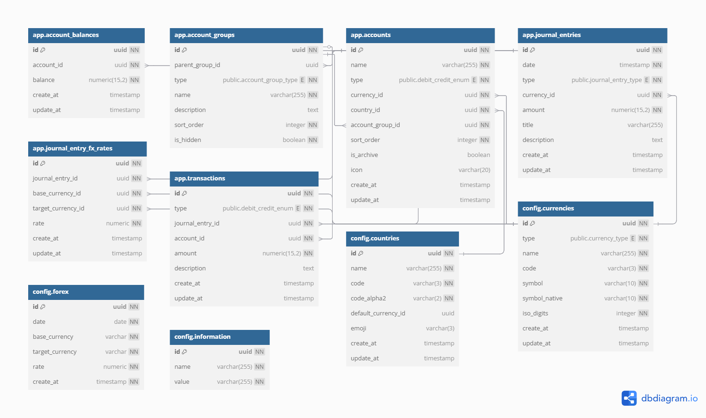

# Don³ - Budget Tracking Web Application

Don³ is a modern, browser-based budget tracking application built with Next.js designed to make managing finances easy, intuitive, and flexible. It aims to support double-entry bookkeeping, multi-country and multi-currency operations, and allows you to track stocks and cryptocurrencies.

## Key Features

- **Fully Operating Within the Browser**: No backend required, everything runs directly in your browser.
- **Double-entry Bookkeeping**: Track your income and expenses accurately with double-entry accounting.
- **Multi-country & Multi-currency**: Seamlessly manage finances in different countries and currencies.
- **(Future) Stock and Cryptocurrency Support**: Monitor and track your investments in stocks and cryptocurrencies.
- **(Future) Generate Financial Statements**: Automatically generate balance sheets, income statements, and other financial reports.
- **(Future) Ask AI for Your Finances**: Get personalized financial insights and suggestions with the built-in AI assistant.

## Current Milestones

| Milestone                                  | Status      | Details                                                                                                           |
| ------------------------------------------ | ----------- | ----------------------------------------------------------------------------------------------------------------- |
| **Basic Features**                         | Complete    | Implemented basic CRUD functionality for managing accounts and records.                                           |
| **Multi-country & Multi-currency Support** | Complete    | Integrated currency conversion API and developed UI for managing multi-country setups.                            |
| **Getting started**                        | Complete    | A step-by-step initial configuration and tutorial for using the app.                                              |
| **Dashboard**                              | In progress | Dashboard with analytics widgets                                                                                  |
| **Backup and Restore Database**            | Planned     | Implementing backup and restore functionality for database management.                                            |
| **Stock & Cryptocurrency Tracking**        | Planned     | Integrating financial APIs to provide real-time stock and cryptocurrency data, with a UI for investment tracking. |
| **Financial Statement Generation**         | Planned     | Developing tools for generating balance sheets and income statements, with export options (CSV, PDF).             |
| **AI Assistant Integration**               | Planned     | Building an AI-powered assistant for financial advice, utilizing natural language processing for user queries.    |

## Getting Started

To run Don³ locally for development:

1. Clone the repository:

   ```bash
   git clone https://github.com/yeonsubak/don3.git
   ```

2. Install dependencies:

   ```bash
   cd don3
   pnpm install
   ```

3. Run the server:

   ```bash
   # Run in production mode
   pnpm build && pnpm start

   # Run in development mode
   pnpm run dev
   ```

Your app will be available at `http://localhost:3000`.

## Environment Variables (dotenv)

This project does not require an .env file to run, as it automatically uses fallback values for all environment variables.

However, if you prefer to use your own custom settings, you can create an .env file in the project root.

Below is the list of supported environment variables:

- EXTERNAL_DATABASE_URL: Connection string for connecting to your own database. Currently, it is only used for caching currency exchange data.

## How to Contribute

1. **Fork the repository**.
2. **Clone** your forked repository locally.
3. Create a new branch for the feature/bug fix you're working on.
4. **Make your changes** and ensure that they work properly.
5. **Commit** your changes with a meaningful message.
6. **Push** your branch and open a pull request.

## Entity Relationship Diagram (ERD)


https://dbdiagram.io/d/Don^3-67b5d8cb263d6cf9a0b98f23

## Thanks to

- [@ourworldincode](https://github.com/ourworldincode): For providing a list of currencies at [`ourworldincode/currency`](https://github.com/ourworldincode/currency).
- [@ksafranski](https://github.com/ksafranski) & [@shivanshtalwar0](https://github.com/shivanshtalwar0): For providing a map of currencies by currency code at [`ksafranski/Common-Currency.json`](https://gist.github.com/ksafranski/2973986?permalink_comment_id=5284647#gistcomment-5284647).
- [@chalda-pnuzig](https://github.com/chalda-pnuzig): For providing a complete list of emojis by category for the EmojiPicker component.

## License

This project is licensed under the MIT License - see the [LICENSE](LICENSE) file for details.
