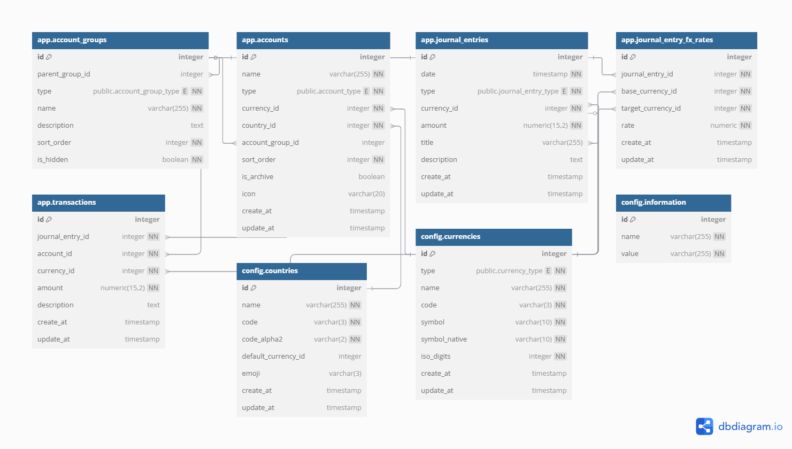

# Don³ - Budget Tracking Web Application

Don³ is a modern, browser-based budget tracking application built with Next.js designed to make managing finances easy, intuitive, and flexible. It aims to support double-entry bookkeeping, multi-country and multi-currency operations, and allows you to track stocks and cryptocurrencies.

## Key Features

- **Fully Operating Within the Browser**: No backend required, everything runs directly in your browser.
- **Double-entry Bookkeeping**: Track your income and expenses accurately with double-entry accounting.
- **Multi-country & Multi-currency**: Seamlessly manage finances in different countries and currencies.
- **Stock and Cryptocurrency Support**: Monitor and track your investments in stocks and cryptocurrencies.
- **Generate Financial Statements**: Automatically generate balance sheets, income statements, and other financial reports.
- **Ask AI for Your Finances**: Get personalized financial insights and suggestions with the built-in AI assistant.

## Development Process Tracker

We aim to keep development streamlined, organized, and transparent. Here's the current status and process of the project:

### Current Milestones

| Milestone                                   | Status      | Details                                                                                                  |
| ------------------------------------------- | ----------- | -------------------------------------------------------------------------------------------------------- |
| **Initial Setup & Design**                  | Completed   | Setting up Next.js framework with required configurations and creating basic UI components.              |
| **Double-entry Bookkeeping Implementation** | In Progress | Setting up double-entry system logic and implementing transaction entry and tracking.                    |
| **Multi-country & Multi-currency Support**  | Next        | Adding currency conversion API and localization for different countries.                                 |
| **Stock & Cryptocurrency Tracking**         | Upcoming    | Integrating with financial APIs for live stock and cryptocurrency data, and UI for tracking investments. |
| **Financial Statement Generation**          | Upcoming    | Developing balance sheet and income statement report generation with export options (CSV, PDF).          |
| **AI Assistant Integration**                | Future      | Building AI-powered assistant for financial advice and natural language processing for user queries.     |

### How to Contribute

1. **Fork the repository**.
2. **Clone** your forked repository locally.
3. Create a new branch for the feature/bug fix you're working on.
4. **Make your changes** and ensure that they work properly.
5. **Commit** your changes with a meaningful message.
6. **Push** your branch and open a pull request.

### Getting Started

To run Don³ locally for development:

1. Clone the repository:

   ```bash
   git clone https://github.com/yeonsubak/dondondon.git
   ```

2. Install dependencies:

   ```bash
   cd dondondon
   pnpm install
   ```

3. Run the development server:
   ```bash
   pnpm run dev
   ```

Your app will be available at `http://localhost:3000`.

## Entity Relationship Diagram (ERD)



## Thanks to

- @ourworldincode: Providing list of currencies at [`ourworldincode/currency`](https://github.com/ourworldincode/currency).
- @ksafranski and @shivanshtalwar0: Providing a map of currencies by currency code at [`ksafranski/Common-Currency.json`](https://gist.github.com/ksafranski/2973986?permalink_comment_id=5284647#gistcomment-5284647)

## License

This project is licensed under the MIT License - see the [LICENSE](LICENSE) file for details.
